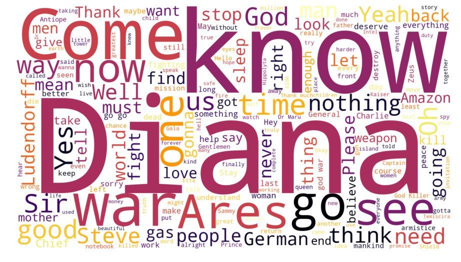
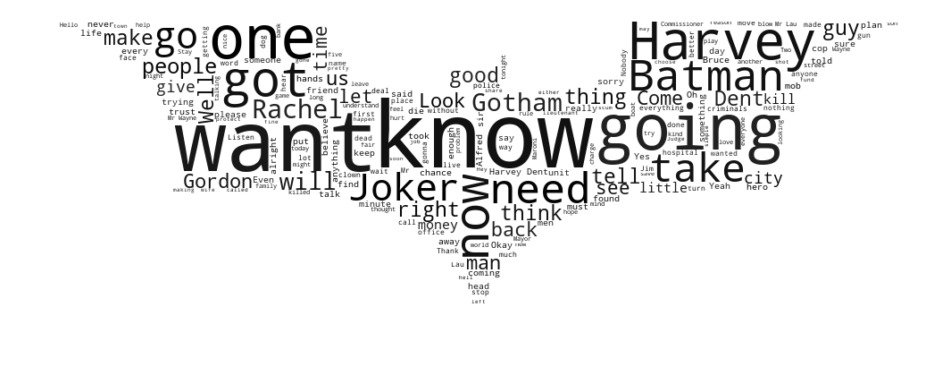
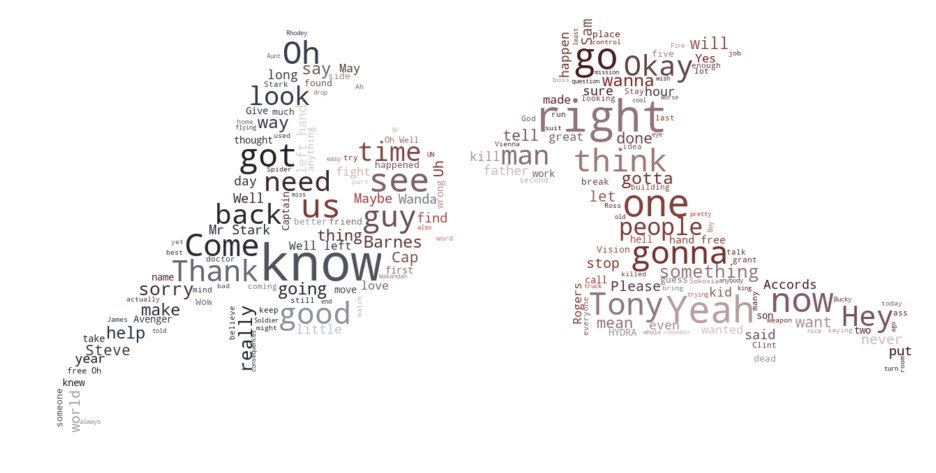
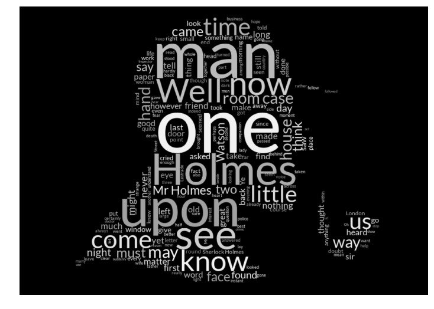
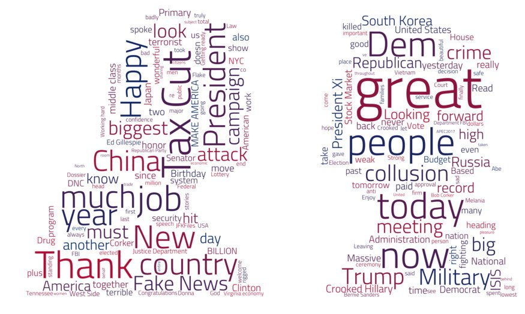
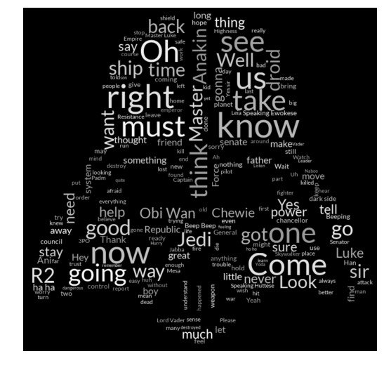

This is part 2 of DataViz Mastery. In part 1, we learned how to create Treemaps using Python - [Read it here](https://mubaris.com/2017-11-05/dataviz-mastery-part1). In this post we will learn how to create Word Clouds using Python. So, let's get started.

## Word Cloud

A Word Cloud (or tag cloud) is a visual representation for text data, typically used to depict keyword metadata (tags) on websites, to visualize free form text or to analyses speeches( e.g. election’s campaign). Tags are usually single words, and the importance of each tag is shown with font size or color. This format is useful for quickly perceiving the most prominent terms and for locating a term alphabetically to determine its relative prominence.

### Examples

* Top 1000 most common password


* Word Cloud of Trump Insults


## The Code

### Required Libraries

* [Numpy](https://numpy.org)

* [Matplotlib](https://matplotlib.org/)

* [wordcloud](https://github.com/amueller/word_cloud)

* [PILLOW](https://python-pillow.org/)

Creating Word Cloud is very easy with the help [wordcloud](https://github.com/amueller/word_cloud) developed by [Andreas Mueller](https://amueller.github.io/).

### Word Cloud 1 - Simple

We will create a Word Cloud of top words from Wonder Woman Movie. We will use the movie script provided in [this website](https://www.springfieldspringfield.co.uk/movie_script.php?movie=wonder-woman-2017). We will need to remove [Stop Words](https://en.wikipedia.org/wiki/Stop_words) from the script before creating the cloud. `wordcloud` library provides a list of stop words. We will use that for our usage.


```python
from wordcloud import WordCloud, STOPWORDS
import matplotlib
import matplotlib.pyplot as plt

%matplotlib inline
matplotlib.rcParams['figure.figsize'] = (16.0, 9.0)
```


```python
# Reading the script
script = open("wonderwoman.txt").read()
# Set of Stop words
stopwords = set(STOPWORDS)
stopwords.add("will")
# Create WordCloud Object
wc = WordCloud(background_color="white", stopwords=stopwords, 
               width=1600, height=900, colormap=matplotlib.cm.inferno)
# Generate WordCloud
wc.generate(script)
# Show the WordCloud
plt.figure()
plt.imshow(wc, interpolation="bilinear")
plt.axis("off")
```


    (-0.5, 1599.5, 899.5, -0.5)





It's very clear that, "Diana" is the most repeated word in the movie.

### Word Cloud 2 - With Mask

We can also create Word Clouds with custom masks. We will create a word cloud of top words from "The Dark Knight(2008)" movie with a Batman symbol mask. [Script Link](https://www.springfieldspringfield.co.uk/movie_script.php?movie=dark-knight-the-batman-the-dark-knight)


```python
from PIL import Image
import numpy as np
from wordcloud import WordCloud, STOPWORDS
import matplotlib
import matplotlib.pyplot as plt

%matplotlib inline
matplotlib.rcParams['figure.figsize'] = (16.0, 9.0)
```


```python
script = open("batman.txt").read()
stopwords = set(STOPWORDS)
batman_mask = np.array(Image.open("batman-logo.png"))

# Custom Colormap
from matplotlib.colors import LinearSegmentedColormap
colors = ["#000000", "#111111", "#101010", "#121212", "#212121", "#222222"]
cmap = LinearSegmentedColormap.from_list("mycmap", colors)

wc = WordCloud(background_color="white", stopwords=stopwords, mask=batman_mask,
               width=1987, height=736, colormap=cmap)
wc.generate(script)
plt.figure()
plt.imshow(wc, interpolation="bilinear")
plt.axis("off")
```


    (-0.5, 999.5, 369.5, -0.5)





### Word Cloud 3 - Colored Mask

We will create Word Cloud of "Captain America: Civil War" [script](https://www.springfieldspringfield.co.uk/movie_script.php?movie=captain-america-civil-war) with following mask.


This method colorizes the cloud with average color in the area.


```python
from PIL import Image
import numpy as np
import matplotlib.pyplot as plt
import matplotlib
from wordcloud import WordCloud, STOPWORDS, ImageColorGenerator

%matplotlib inline
matplotlib.rcParams['figure.figsize'] = (16.0, 9.0)
```


```python
mask = np.array(Image.open("civilwar.jpg"))
# Reading the script
script = open("civilwar.txt").read()
# Set of Stop words
stopwords = set(STOPWORDS)
# Create WordCloud Object
wc = WordCloud(background_color="white", stopwords=stopwords, 
               width=1280, height=628, mask=mask)
wc.generate(script)
# Image Color Generator
image_colors = ImageColorGenerator(mask)

plt.figure()
plt.imshow(wc.recolor(color_func=image_colors), interpolation="bilinear")
plt.axis("off")
```


    (-0.5, 1279.5, 627.5, -0.5)





### Word Cloud 4 - Cannon of Sherlock Holmes

In this example, we will create a word cloud from the "Canon of Sherlock Holmes".


```python
import random
from PIL import Image
import numpy as np
from wordcloud import WordCloud, STOPWORDS
import matplotlib
import matplotlib.pyplot as plt

%matplotlib inline
matplotlib.rcParams['figure.figsize'] = (16.0, 9.0)
```


```python
# Custom Color Function
def grey_color_func(word, font_size, position, orientation, random_state=None,
                    **kwargs):
    return "hsl(0, 0%%, %d%%)" % random.randint(60, 100)

script = open("canon.txt").read()
stopwords = set(STOPWORDS)
stopwords.add("said")
stopwords.add("will")
mask = np.array(Image.open("sherlock.jpeg"))

wc = WordCloud(background_color="black", stopwords=stopwords, mask=mask,
               width=875, height=620,  font_path="lato.ttf")
wc.generate(script)
plt.figure()
plt.imshow(wc.recolor(color_func=grey_color_func, random_state=3), 
            interpolation="bilinear")
plt.axis("off")
```


    (-0.5, 874.5, 619.5, -0.5)





### Word Cloud 5 - Trump Tweets

I have collected last 193 tweets from Mr. Donald Trump after removing urls and hashtags and without considering retweets. We will make a Word Cloud of top words from these tweets.


```python
from PIL import Image
import numpy as np
import matplotlib.pyplot as plt
import matplotlib
from wordcloud import WordCloud, STOPWORDS, ImageColorGenerator

%matplotlib inline
matplotlib.rcParams['figure.figsize'] = (16.0, 9.0)
```


```python
mask = np.array(Image.open("trump.jpg"))
# Reading the script
script = open("trump.txt").read()
# Set of Stop words
stopwords = set(STOPWORDS)
stopwords.add("will")

from matplotlib.colors import LinearSegmentedColormap
colors = ["#BF0A30", "#002868"]
cmap = LinearSegmentedColormap.from_list("mycmap", colors)

# Create WordCloud Object
wc = WordCloud(background_color="white", stopwords=stopwords,
                 font_path="titilium.ttf", 
               width=853, height=506, mask=mask, colormap=cmap)
wc.generate(script)


plt.figure()
plt.imshow(wc, interpolation="bilinear")
plt.axis("off")
```


    (-0.5, 2399.5, 1422.5, -0.5)





### Word Cloud 6 - All Star Wars Scripts


```python
import random
from PIL import Image
import numpy as np
from wordcloud import WordCloud, STOPWORDS
import matplotlib
import matplotlib.pyplot as plt

%matplotlib inline
matplotlib.rcParams['figure.figsize'] = (16.0, 9.0)
```


```python
# Custom Color Function
def grey_color_func(word, font_size, position, orientation, random_state=None,
                    **kwargs):
    return "hsl(0, 0%%, %d%%)" % random.randint(60, 100)

script = open("starwars.txt").read()
stopwords = set(STOPWORDS)
stopwords.add("will")
mask = np.array(Image.open("darthvader.jpg"))

wc = WordCloud(background_color="black", stopwords=stopwords, mask=mask,
          width=736, height=715,  font_path="lato.ttf")
wc.generate(script)
plt.figure()
plt.imshow(wc.recolor(color_func=grey_color_func, random_state=3),
           interpolation="bilinear")
plt.axis("off")
```


    (-0.5, 735.5, 714.5, -0.5)





That's all for Word Clouds. We will be continue this series with more visualization tutorials. Checkout the following references and books to learn more. Checkout [this Github Repo](https://github.com/mubaris/dataviz-gallery/tree/master/word-clouds) for the code and more visualizations.

## Resources

* [Word Cloud - DataViz Project](http://datavizproject.com/data-type/tag-cloud/)

* [Word Clouds in Python - wordcloud Documentation](https://amueller.github.io/word_cloud/)

* [Twitter Timeline to Word Cloud](http://sebastianraschka.com/Articles/2014_twitter_wordcloud.html)

## Data Visualization Books

1) <a href="http://amzn.to/2iww3ab" target="_blank">Storytelling with Data: A Data Visualization Guide for Business Professionals</a>

2) <a href="http://amzn.to/2zf20vp" target="_blank">The Truthful Art: Data, Charts, and Maps for Communication</a>

3) <a href="http://amzn.to/2ixm7gC" target="_blank">Data Visualization: a successful design process</a>

4) <a href="http://amzn.to/2herZ1K" target="_blank">Data Visualisation: A Handbook for Data Driven Design</a>

<div id="mc_embed_signup">
<form action="//mubaris.us16.list-manage.com/subscribe/post?u=f9e9a4985cce81e89169df2bf&amp;id=3654da5463" method="post" id="mc-embedded-subscribe-form" name="mc-embedded-subscribe-form" class="validate" target="_blank" novalidate>
    <div id="mc_embed_signup_scroll">
    <label for="mce-EMAIL">Subscribe for more Awesome!</label>
    <input type="email" value="" name="EMAIL" class="email" id="mce-EMAIL" placeholder="email address" required>
    <!-- real people should not fill this in and expect good things - do not remove this or risk form bot signups-->
    <div style="position: absolute; left: -5000px;" aria-hidden="true"><input type="text" name="b_f9e9a4985cce81e89169df2bf_3654da5463" tabindex="-1" value=""></div>
    <div class="clear"><input type="submit" value="Subscribe" name="subscribe" id="mc-embedded-subscribe" class="button"></div>
    </div>
</form>
</div>
